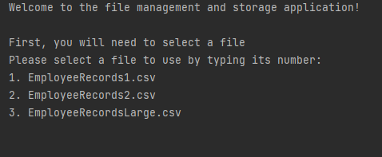

# Employee-CSV

## Project Brief

### Overall Goals

- To read data from a ```.csv``` file (provided), parse it, populate objects and add to a collection.
- To efficiently write the data from the objects to a relational database using ```JDBC```.
- To demonstrate good programming practices in OOP, SOLID, design patterns, testing, logging, etc.

### Phase 1 – Initial Reading and Cleaning

- Create a new project and write code to read data from an Employee CSV file.
- As it is read in, add each record read to a new object of a suitable class and then add those objects to a collection.
- Any corrupt or duplicated data should be added to a separate collection for further analysis.
- Write tests to ensure data is being managed correctly.
- Consider which date class would be best to use for the date fields – there is one in ```java.util``` and another
  in ```java.sql```.
- Provide a simple user interface to display the results of reading the file – how many unique, clean records there are,
  how many duplicates, how many records with missing fields, possibly display the questionable records.
- User the provided ```EmployeeRecords1.csv``` and ```EmployeeRecords2.csv``` for your testing and optionally create
  your own test files to help with your JUnit tests.

  #### Notes:
    - Consider preparing your tests beforehand, in line with a TDD approach.
    - Since the overall purpose of the project is data migration, we want to make sure that only clean data is
      transferred.
    - Consider your code structure, since later in the project we will be increasing the size of the data and looking at
      the efficiency of the code.
    - The choice of collection will be important as there is some duplication of the employee records.

### Phase 2 – Persist to Database

- Write the SQL statements to create a table and to persist data to that table.
- If the table exists, it will need to be dropped first.
- Install the drivers for the database to be used (MySQL) and create a connection.
- Create a data access object ([DAO pattern](https://en.wikipedia.org/wiki/Data_access_object)) to persist the data to
  the database.
- Persist employee records and write code to retrieve individual records from the database.

  #### Notes:
    - Remember to use try-with-resources to ensure connections are closed as soon as they have been used, if
      appropriate.
    - Care needs to be taken with transferring dates from Java to SQL; make sure ```Strings``` are not used for dates.
    - It is easy to make this process very slow by creating a new connection for each record – consider how to ensure
      that you reuse connections.

### Phase 3 – Add Multithreading

- Use the second file, ```EmployeeRecordsLarge.csv```, which can be assumed to have already been cleaned.
- Record time taken to persist to MySql before implementing multiple threads.
- Add multithreading to your application for writing the data to the database, comparing the execution time with the
  single-threaded version.
- Try different numbers of threads and compare the results – what is the optimum number of threads? Record this
  information in your ```README.md```.

  #### Notes:
    - Run tests to ensure the integrity of the data - make sure data has not been corrupted by adding multithreading to
      the application (check whether race conditions, for example, have changed the operation of the program).

### Phase 4 - Add Streams and Lambdas

- Modify code to make use of functional programming concepts – lambdas and streams.
- Keep the original code and then run tests to see if efficiency has improved by adding functional code.

  #### Notes:
    - Functional programming is not all about speed, but also thread safety, ease of reading, etc.
    - Consider whether your code has been improved as a result of the changes and comment on this in
      your ```README.md```.

## Requirements

- Java 18
- MySQL 8

## Using the Application

### Compiling and Running

1. Clone the repository with:

    ```shell
    git clone https://github.com/Erratika/Employee-CSV.git
    ```

2. Compile the application with:

    ```shell
    javac src/main/java/com/sparta/AlphaTeam/core/Main.java
    ```

3. Add a ```databse.properties``` file into ``src/main/resources`` with the following:

    ```properties
    db.url=jdbc:mysql://localhost:3306/
    db.username=<Your Username>
    db.password=<Your Password>
    ```

   populating ``db.username`` with your MySQL database username and ``db.password`` with the associated password for
   that
   user.

4. Make sure MySQL 8 is running on localhost with port 3306.
5. Run the application with:

    ```shell
    java Main
    ```

### User Guide

Once the application is running you will be presented with a selection of ``.csv`` files to choose from:


## Design

### Reader

### Parsing

The ``EmployeeConverter.java`` class is responsible for parsing each entry in the ``.csv`` files and creating an
Employee entry for each line. It does this through the method called convertStringsToEmployees which takes
a ``List<String>`` and
outputs a ``List<Employee>``

### Data Filtering and Cleaning

### SQL and Database Schema

- The ``ConnectionFactory.java`` employs the [Singleton](https://refactoring.guru/design-patterns/singleton) pattern and
  froms a connection to the MySQL database with the details provided into the ``src/main/resources/database.properties``
  file.
- The ``DatabaseInit.java`` is responsible for initialising the database and creating the table for which employee
  entries
  are entered into. The table is created with the following schema:

    ```sql
        CREATE TABLE `employees` " +
        "
    (
        `id`
        int
        NOT
        NULL,
        " +
            "
        `prefix`
        varchar
        (
        10
        ) DEFAULT NULL," +
        " `first_name` varchar
        (
            45
        ) DEFAULT NULL," +
        " `middle_initial` char
        (
            1
        ) DEFAULT NULL," +
        " `last_name` varchar
        (
            45
        ) DEFAULT NULL," +
        " `gender` char
        (
            1
        ) DEFAULT NULL," +
        " `email` varchar
        (
            45
        ) DEFAULT NULL," +
        " `date_of_birth` date DEFAULT NULL," +
        " `date_of_joining` date DEFAULT NULL," +
        " `salary` int DEFAULT NULL," +
        " PRIMARY KEY
        (
            `id`
        )," +
        " UNIQUE KEY `email_UNIQUE`
        (
            `email`
        ))" +
        " ENGINE =InnoDB DEFAULT CHARSET =utf8mb4 " +
        " COLLATE =utf8mb4_0900_ai_ci
    ```
  for the table we treat the ``id`` ass the primary key, meaning that each `id` has to be unique. We also reasonably
  assumed that ``email`` entry on the table should also be unique.
- The ``EmployeeDAO.java`` is a [DAO](https://en.wikipedia.org/wiki/Data_access_object)(Data Access Object) which purely
  handles queries made to the database for the ``Employee.java`` object. It contains 3 functions for add (taking
  an ``Employee.java`` object as a parameter), getAll(returning a list of ``Employee.java`` objects from the database)
  and get(which takes the ``Employee.java`` ``id`` as a parameter and returns a single ``Employee.java`` object)
  .

### Multithreading

### Lambdas

## Testing

### Reader

### EmployeeConverter
For testing the ``EmployeeConverter.java`` 

### EmployeeDAO

## Results
### Functional programming (Lambdas) vs imperative 
- Keep the original code and then run tests to see if efficiency has improved by adding functional code.
In response to this task, a Timer was created such that the operation to read the file in could be timed.
two varients of the code to read the file were created, one using lambda expressions and one with imerative methods
upon execution, the program will compare the time taken for both methods and present them to the user.
for the three files times to read the files were tracked, and correspond as follows
**File 1**
- 
| lambda | imperative |
| ------ | ---------- |
| 83ms | 132ms |
| 56ms | 61ms |
| 49ms | 56ms |
|58ms | 62ms |

**File 2**

| lambda | imperative |
| ------ | ---------- |
| 57ms | 133ms |
| 62ms | 73ms |
| 50ms | 58ms |
| 56ms | 64ms |

**File 3**

| lambda | imperative |
| ------ | ---------- |
| 423ms | 441ms |
| 346ms | 297ms |
| 319ms | 377ms |
| 295ms | 295ms |

#### analysis
 - it seems that when the program is initialised, the imperative programming is run first, but is always considerably slower.
 - this may be due to the system still warming up at this point causing the read action to be slower, it is notable in later tests for file 1 and 2 that they are much closer together
 - file 3 seems to show the most variation as it is the largest array, it is also the only occason when lambdas receive a slower result
 - due to the results for file three, the conclusion that can be drawn is that lambdas are more efficient over small tasks but it is uncertain for longer ones
 
 ### writing file 3 to the database via multithreading
 file three is the largest of the files so using this file to test the speed of connection to the database should provide the best result of any variance
 we used multithreading to split the workload between threads so each can push to the database and then used the timer to record how long the push took to complete
 
 | thread count | 1 | 3 | 5 | 6 | 7 | 10 | 100 |
 | ------------ | ----- | ------ | ----- | ----- | ----- |------------------| --- |
 | execution and buid time | 93.358 seconds  | 85.374 seconds | 83.88 seconds | 83.786 seconds  | 84.891 seconds | 85.952 seconds | 83.392 seconds   |
 | execution time | 93.357 seconds | 85.336 seconds | 83.831 seconds | 83.739 seconds | 84.839 seconds | 85.897 seconds | 83.329 seconds   |
 
 #### analysis
 from the range of different values tested there are three conclusions that can be drawn
 - using any number of threads more than one seems to be beneficial for the task
 - the optimal range of threads for this example is around 5-6, however..
 - using any number of threads more than one seems to yeild barely any variation in time, 100 is as effective as 5 or 6.
 
## Git Workflow

We made a **_dev_** branch based off of **_master_** at the start of the project and protected **_master_** for approved
pull
requests
only. Then made 5 other branches from **_dev_**:

- **Alo**
- **Jeffrey**
- **kira**
- **marc**
- **matson**

This allowed for everyone to work on features on their own branch separately and avoid merge conflicts as much as
possible.
Once a feature was complete it was pushed back to **_dev_** and at the end of the day we made a pull request from
**_dev_** into **_master_** so that we had a clean working tree for the next day.

### Git Log

## Contributors

- [Jeffrey Champion](https://github.com/Jchampion42)
- (Scrum master) 
- primary contributions:
    - project structure
    - enumbers,
    - user interface,
    - MVC- main, sqlprogram, controller, usermanager, datamanager
    - conenction of these classes to use other modules
    - ConnectionFactory and DatabaseInit with Marc.
    - CustomThreadFactory/AddTask with Michael Matson.
    - test results for markdown

- [Kira Coke](https://github.com/kira-coke)
- [Marc Murray](https://github.com/Erratika)
  - Git Helper 
  - Worked on:
    - EmployeeConverter and EmployeeConverterTest.
    - DAO,EmployeeDAO and EmployeeDAOTest.
    - Logging.
    - ConnectionFactory and DatabaseInit with Jeffrey.
    - README for a majority of above, requirements, running and Git Workflow.
- [Michael Alo](https://github.com/Mikesjai)
- [Michael Matson](https://github.com/M-Matson)
